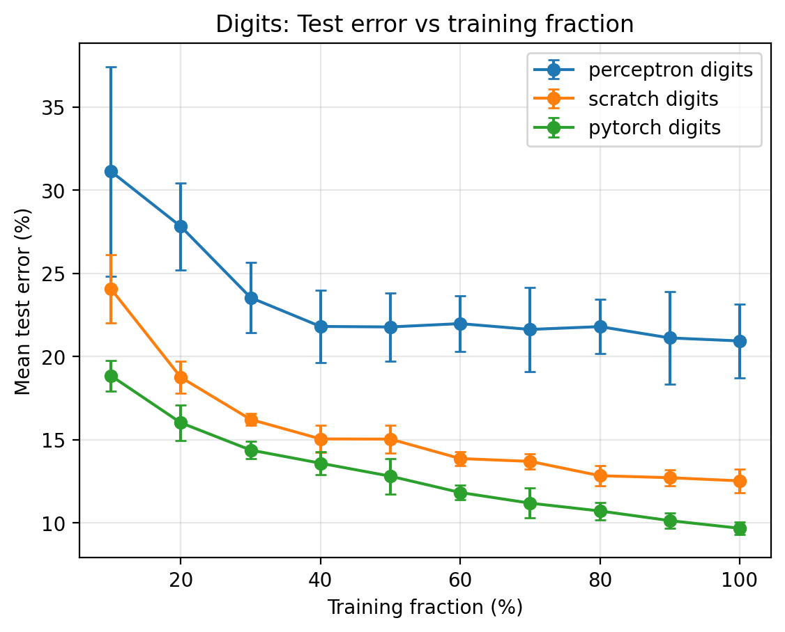
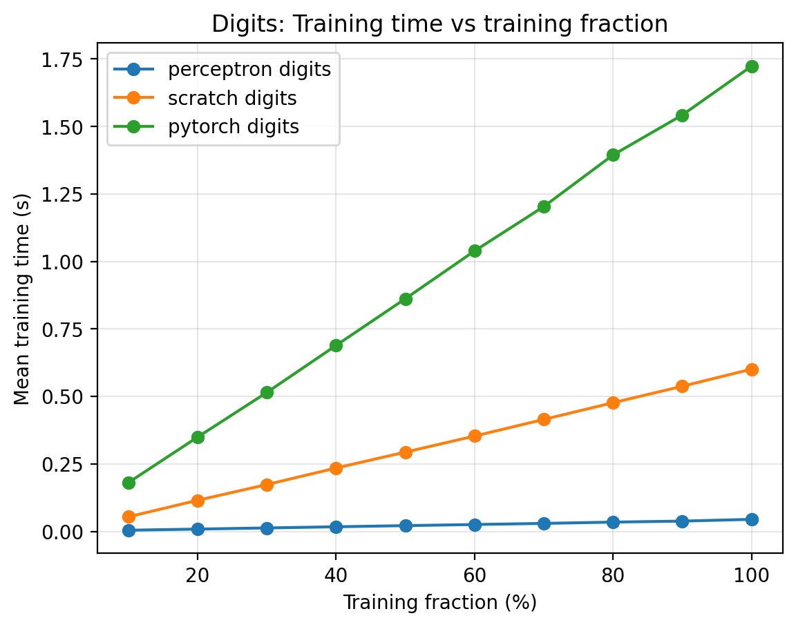
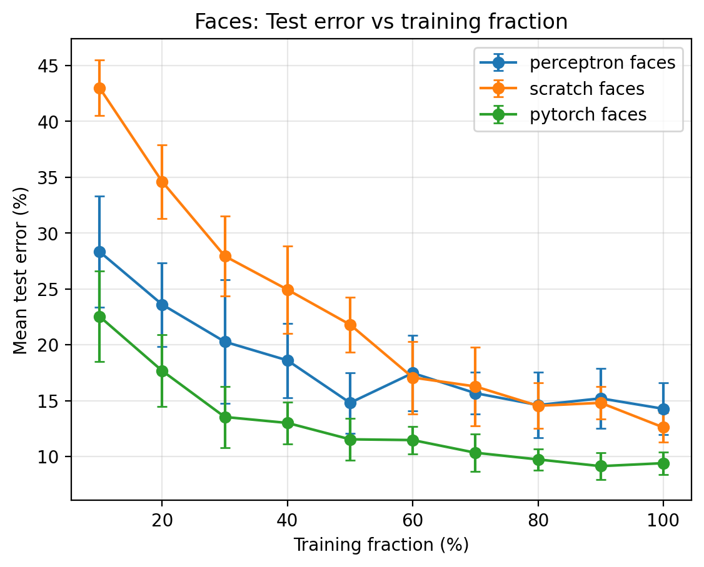
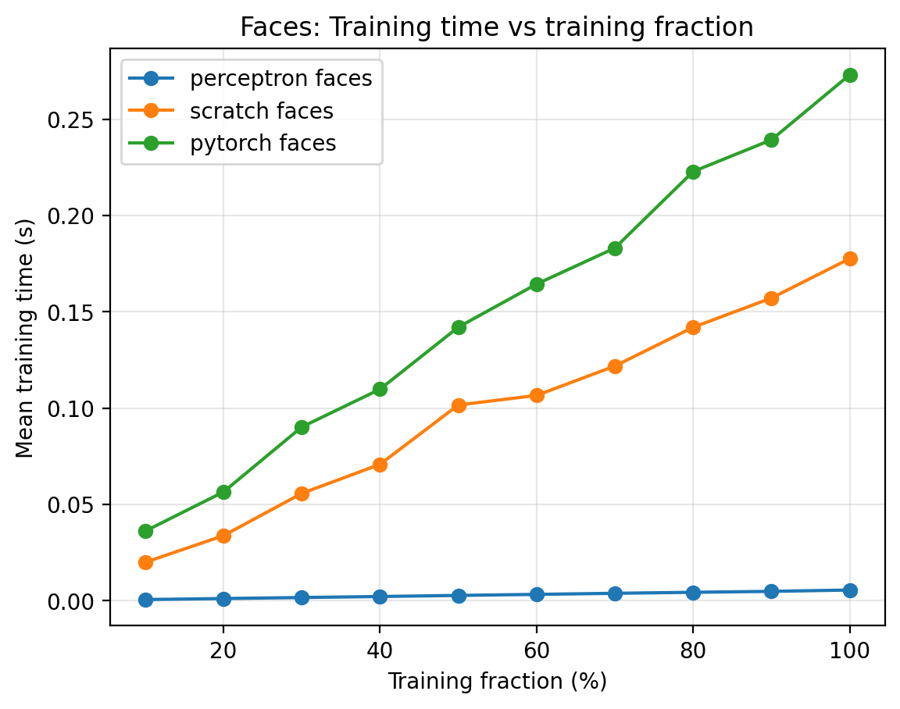

# Face and Digit Classification  
**CS 440 — Spring 2026 — Final Project Report**

**Orland Geronimo (ogg9), Reuben Geronimo (rg1090)**

---

## 1. Introduction

This report summarizes our implementation and comparison of three classifiers on two image benchmarks: handwritten digits (10 classes, 28×28 images) and frontal face detection (binary labels, 70×60 images). We trained a **multiclass / binary perceptron**, a **two-hidden-layer neural network implemented in NumPy**, and the **same architecture in PyTorch**. For each classifier and dataset we measured **mean test error** and **mean training time** as a function of the fraction of the training set used, averaging over **10** random subsamples per fraction. The plots below use **error bars of one standard deviation** on test error.

---

## 2. Features and representations

We use **raw grayscale pixel intensities** as inputs. Digit images are **28×28** (784 dimensions after flattening). Face images are **70×60** (4200 dimensions after flattening). No hand-crafted features beyond this vectorization were used.

---

## 3. Algorithms

### 3.1 Perceptron

**Digits (multiclass).** We maintain a separate weight vector and bias for each of the 10 classes. For a flattened image \(x\), scores are \(s_y = w_y^\top x + b_y\), and we predict \(\arg\max_y s_y\). Training follows the standard multiclass perceptron update: on a mistake, we **add** the example to the weights of the true class and **subtract** it from the weights of the predicted class (and adjust biases accordingly). There is no explicit loss function; updates occur only on errors.

**Faces (binary).** A single weight matrix (matching the image shape) and scalar bias define a linear decision rule: predict the positive class if \(w^\top x + b \geq 0\). On a mistake, weights and bias are nudhed in the direction that would have produced the correct sign.

In both cases we perform **three full passes** over the (subsampled) training set per training run. The perceptron is simple and fast but cannot represent nonlinear decision boundaries.

### 3.2 Neural network from scratch (NumPy)

**Architecture.** The network is **input → hidden₁ → hidden₂ → output** with full connectivity, matching the course requirement for two hidden layers.

- **Digits:** \(784 \rightarrow 128 \rightarrow 64 \rightarrow 10\).
- **Faces:** \(4200 \rightarrow 128 \rightarrow 64 \rightarrow 2\).

**Activations and output.** Hidden layers use **ReLU** (\(a = \max(0, z)\)). The output layer uses a **numerically stable softmax** over class logits. Training minimizes **average cross-entropy** between the softmax probabilities and **one-hot** targets.

**Optimization.** We use **mini-batch stochastic gradient descent** with learning rate **0.01**, **20** epochs, and batch size **32**. Weights are initialized with small Gaussian noise scaled in a He-style manner; biases start at zero.

**Backpropagation.** We summarize the gradient flow used in our implementation. Let \(X\) denote a batch of inputs, and let the forward pass be \(z_1 = X W_1 + b_1\), \(a_1 = \mathrm{ReLU}(z_1)\), \(z_2 = a_1 W_2 + b_2\), \(a_2 = \mathrm{ReLU}(z_2)\), \(z_3 = a_2 W_3 + b_3\), \(\hat{y} = \mathrm{softmax}(z_3)\). With one-hot labels \(Y\), the cross-entropy gradient with respect to the logits is proportional to \(\hat{y} - Y\). Denoting this (after averaging over the batch) by \(\partial L / \partial z_3\), we obtain \(\partial L / \partial W_3 = a_2^\top (\partial L / \partial z_3)\) and \(\partial L / \partial b_3\) as the row-sum of that matrix. Propagating backward, \(\partial L / \partial a_2 = (\partial L / \partial z_3) W_3^\top\), and because ReLU’s derivative is an indicator \(\mathbf{1}[z_2 > 0]\), \(\partial L / \partial z_2 = (\partial L / \partial a_2) \odot \mathbf{1}[z_2 > 0]\). The same pattern repeats for the first hidden layer with \(\partial L / \partial z_1 = (\partial L / \partial a_1) \odot \mathbf{1}[z_1 > 0]\). We then apply SGD: \(W_i \leftarrow W_i - \eta \, \partial L / \partial W_i\) (and analogously for biases) with \(\eta = 0.01\).

### 3.3 Neural network in PyTorch

We implement the **same topology**: two `Linear` layers with **ReLU** in between, then a final `Linear` to class logits. **Digits:** \(784 \rightarrow 128 \rightarrow 64 \rightarrow 10\). **Faces:** \(4200 \rightarrow 128 \rightarrow 64 \rightarrow 2\). We minimize **cross-entropy loss** (applied to logits) using the **Adam** optimizer with learning rate **\(10^{-3}\)**, **20** epochs, and batch size **32**, with shuffled minibatches via `DataLoader`.

---

## 4. Experimental protocol

For each training fraction \(p \in \{10, 20, \ldots, 100\}\), we **uniformly sample without replacement** \(p\%\) of the official training set. We repeat this **10** times per \((\text{classifier}, p)\) pair. Each repetition trains a **fresh** model from scratch, then evaluates **classification error on the full held-out test set**. We record wall-clock **training time** for that fit (excluding data loading where the code separates it). Mean test error, standard deviation of test error, and mean training time are aggregated over the 10 runs. This protocol matches the provided driver `q2q3_run_all_stats.py` with `-i 10`. Hyperparameters are fixed across fractions and are those stated in Section 3.

---

## 5. Results

### 5.1 Digits

**Figure 1.** Digits: mean test error (±1 std) vs. fraction of training data. The multiclass perceptron improves with more data but plateaus well above the neural networks. The NumPy MLP improves steadily; the PyTorch MLP achieves the **lowest** error across almost all fractions.

**Figure 2.** Digits: mean training time vs. training fraction. The perceptron is orders of magnitude faster per run. The NumPy network scales roughly linearly with data size; PyTorch is the **slowest**, reflecting additional framework work per batch and Adam’s overhead.

**Table 1.** Representative performance at **100%** of the training set (means over 10 subsamples; subsample at 100% is the full training set, so variability reflects initialization and any remaining stochasticity in training).

| Classifier        | Mean test error | Std (error) | Mean train time (s) |
|-------------------|-----------------|------------|----------------------|
| Perceptron        | 20.9%           | 2.2%       | 0.045                |
| Scratch MLP       | 12.5%           | 0.7%       | 0.60                 |
| PyTorch MLP       | **9.7%**        | **0.4%**   | 1.72                 |

### 5.2 Faces

**Figure 3.** Faces: mean test error (±1 std) vs. training fraction. At small fractions, the **scratch** MLP shows the **highest** error and variance; with enough data it catches up substantially. The **PyTorch** MLP remains the most accurate overall. The perceptron is a strong linear baseline on this task but does not match the best nonlinear models at full data.

**Figure 4.** Faces: mean training time vs. training fraction. Again the perceptron is negligible in time; the scratch and PyTorch networks grow with training set size, with PyTorch slower per fraction.

**Table 2.** Performance at **100%** of the training set (same aggregation as Table 1).

| Classifier        | Mean test error | Std (error) | Mean train time (s) |
|-------------------|-----------------|------------|----------------------|
| Perceptron        | 14.3%           | 2.3%       | 0.0055               |
| Scratch MLP       | 12.6%           | 1.3%       | 0.18                 |
| PyTorch MLP       | **9.4%**        | **1.0%**   | 0.27                 |

---

## 6. Discussion

**Accuracy.** On **both** datasets, the **PyTorch** MLP achieved the **lowest** mean test error at full training data (about **9.7%** on digits and **9.4%** on faces in our run). The **scratch** MLP ranked second on digits and faces at 100%, clearly outperforming the perceptron on digits while remaining competitive on faces. The **perceptron** was the weakest on digits but still respectable on faces, which suggests the face task is closer to linearly separable in pixel space than digit recognition.

**Training time.** The **perceptron** dominated in speed on both tasks. Among nonlinear models, **NumPy** training was **faster than PyTorch on faces** but **slower on digits** at large fractions—digits involve larger batches in wall-clock terms for our PyTorch loop, while the high-dimensional face input makes the pure-Python/NumPy backward pass relatively expensive. Overall, PyTorch’s extra overhead and Adam steps buy better accuracy at a clear time cost on digits.

**Variance.** **Error bars** were generally **largest at small training fractions**, especially for the scratch face network and, to a lesser extent, the perceptron. Random subsampling changes which examples the model sees; with little data, decision boundaries are unstable. Variance **shrinks** as more data is added, and the PyTorch curves often show the **tightest** error bars at high fractions, consistent with more stable optimization.

**Lessons.** Nonlinear models and adaptive optimization help when the mapping from pixels to labels is complex (digits). A linear classifier can still be a surprisingly strong baseline (faces). There is a predictable trade-off between **accuracy** and **training time**, and between **hand-coded** backprop and a **framework** implementation.

---

## 7. External resources

We used course materials, the project `README`, and official documentation for NumPy and PyTorch as needed. No code or written solutions were shared with other teams.

---

*When submitting, export this document to **report.pdf** at the repository root alongside your code, per course instructions.*
